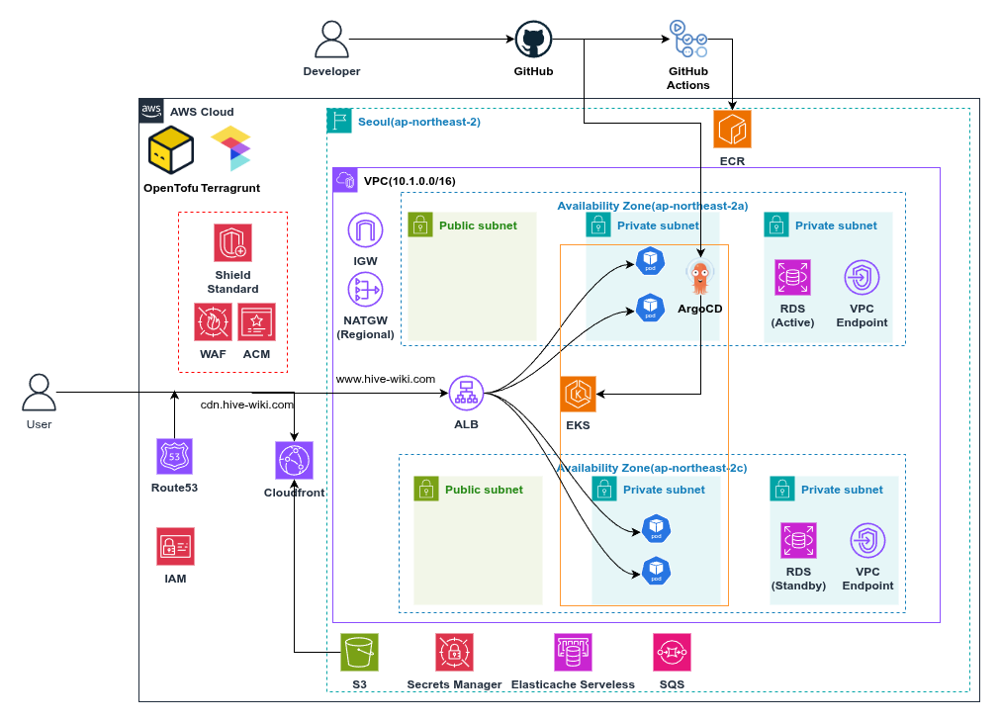
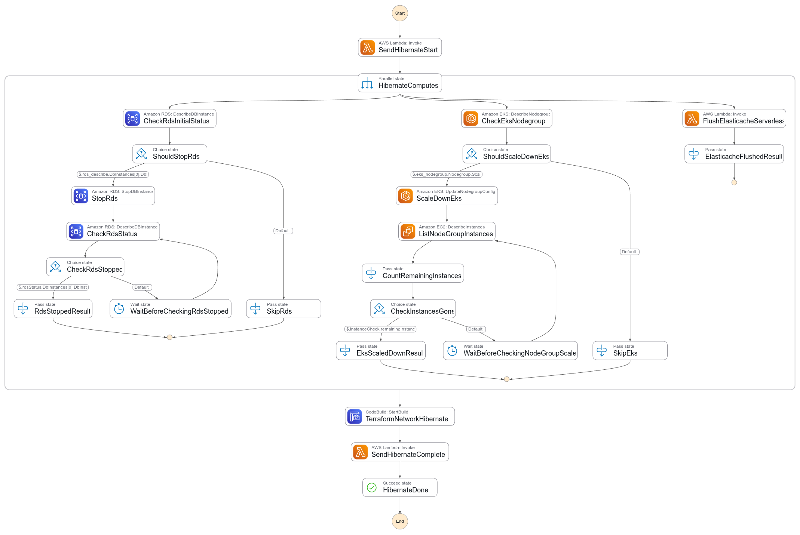
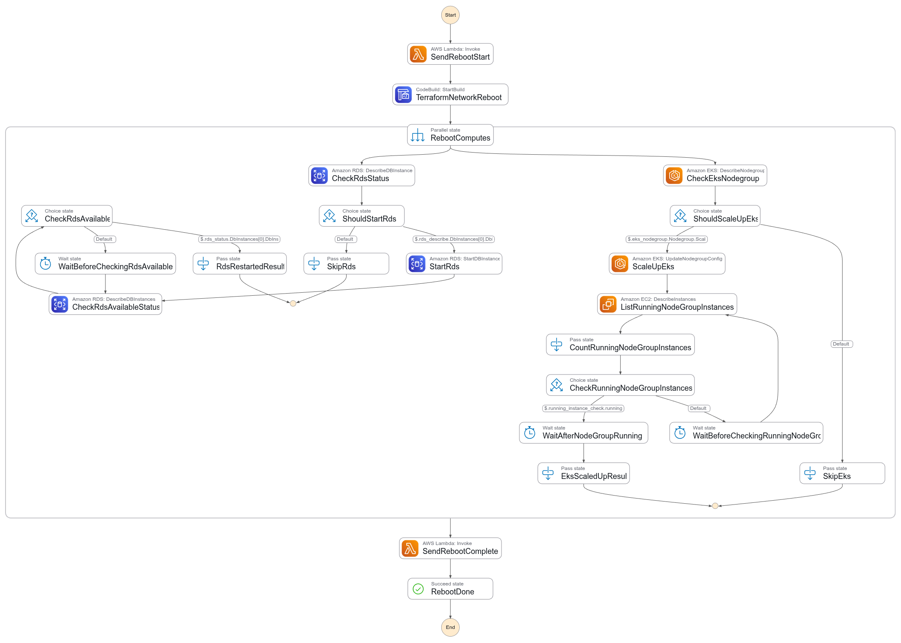
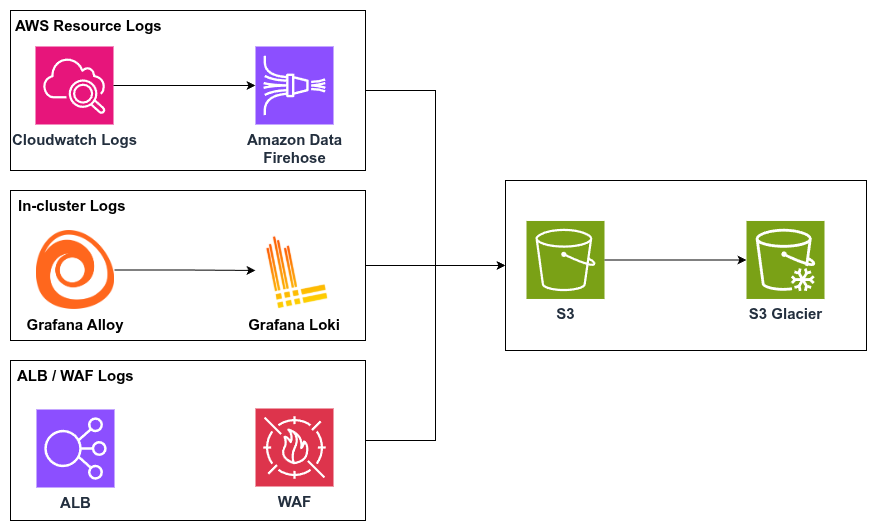

# HiveWiki Infra

🏆 2026학년도 1학기 한림대학교 SW캡스톤디자인 경진대회 금상 수상 프로젝트

HiveWiki의 AWS 인프라를 OpenTofu/Terragrunt로 선언적으로 관리하는 저장소입니다.

- Terragrunt로 `live` 환경과 재사용 가능한 `modules`를 분리
- 개발 환경 비용 최적화를 위한 AWS Stepfunction 기반의 hibernate/reboot 워크플로우
- 단일 EKS 클러스터 안에서 `dev`와 `prod`를 멀티테넌시로 운영하되, Karpenter NodePool을 환경별로 분리
- 워크로드 스케줄링에는 `nodeSelector`와 `taint/tolerations`를 함께 사용, Pod의 네트워킹은 `CiliumNetworkPolicy`를 이용하여 경계 유지

## Architecture At A Glance



```text
live/
  shared/                 계정 공용 리소스 (state bucket, Route53, ACM, ECR)
  cluster/
    vpc/                  네트워크와 VPC endpoint
    observability/        로그/메트릭 저장소
    infra/                EKS control plane, node group, IAM, bastion
    edge/                 CloudFront/WAF 등 엣지 계층
    eks-addons/           Cilium, ArgoCD, Karpenter 등 클러스터 애드온
    logging/              CloudWatch -> S3 아카이빙
    tenants/
      dev/                개발 테넌트 앱/DB/캐시/운영 자동화
      prod/               운영 테넌트 앱/DB/캐시

modules/
  stacks/                 live에서 직접 참조하는 상위 스택
  */                      stacks 내부에서 조합하는 재사용 모듈
```

상세 스택 설명과 의존관계는 [docs/stack-map.md](/home/chaewoon/dev/capstone/hivewiki-infra/docs/stack-map.md)에서 볼 수 있습니다.

## Core Decisions

- `root.hcl`에서 원격 상태 저장소와 AWS provider 기본 태그를 공통 생성합니다.
- `cluster.hcl`, `tenant.hcl`로 환경별 값을 상속해 중복을 줄입니다.
- 공용 플랫폼 리소스와 테넌트 리소스를 분리해 변경 범위를 작게 유지합니다.
- `terragrunt dependency`와 `mock_outputs`를 사용해 스택 간 결합을 명시하면서도 `plan` 경험을 유지합니다.

## Multi-Tenancy Strategy

- `dev`와 `prod`는 단일 EKS 클러스터를 공유하지만, 동일한 노드 풀을 그대로 섞어 쓰지 않습니다.
- `modules/stacks/cluster-eks-addons`에서 Karpenter NodePool을 `system`, `dev`, `prod`로 나누고, 각 풀에 환경 라벨과 taint를 다르게 부여합니다.
- 애플리케이션 워크로드는 `nodeSelector`로 원하는 환경 NodePool만 선택하고, taint/toleration 조합으로 다른 환경 노드에 잘못 올라가지 않도록 격리합니다.
- 클러스터 내부 Pod 간 통신 경계는 `CiliumNetworkPolicy`를 기준으로 나눠, 네임스페이스 분리만이 아니라 네트워크 권한까지 제어합니다.

## Cost-Optimization Automation

`modules/stacks/tenant-dev-ops`는 개발 환경 비용 최적화를 위한 운영 자동화 스택입니다. Lambda, Step Functions, EventBridge Scheduler, CodeBuild를 조합해 컴퓨트 계층과 네트워크 계층을 함께 제어합니다.





- `EventBridge Scheduler`가 예약 시각에 `hibernate` Step Function 실행을 시작하면, 야간 절전을 위해 dev RDS를 중지하고, infra 전용 EKS node group desired size를 `0`으로 낮추고, ElastiCache를 flush한 뒤, CodeBuild로 VPC 스택을 다시 적용해 NAT Gateway와 VPC Endpoint를 줄입니다.
- `EventBridge Scheduler`가 예약 시각에 `reboot` Step Function 실행을 시작하면, 출근 시간대 복구를 위해 CodeBuild로 네트워크를 먼저 되살리고, RDS를 다시 기동하고, EKS node group을 재확장한 뒤, 완료 알림까지 연결합니다.
- 두 워크플로우 모두 시작/완료 Lambda, 스케줄러, 네트워크용 CodeBuild, Slack webhook 연동을 포함하고 있어서, 인프라 변경과 운영 오케스트레이션을 같은 코드베이스에서 관리한다는 점이 특징입니다.

## Logging Architecture



로그는 수집 주체에 따라 서로 다른 경로로 저장하고 아카이빙합니다.

- AWS 리소스 로그: `CloudWatch Logs -> Amazon Data Firehose -> S3 -> S3 Glacier`
- ALB/WAF 로그: `ALB/WAF -> S3 -> S3 Glacier`
- EKS 내부 로그: `Grafana Alloy -> Grafana Loki -> S3`
  `dev`는 retention 기반으로만 운영하고, `prod`는 장기 보관을 위해 Glacier 아카이빙을 적용합니다.

## Toolchain

필수 도구:

- `tofu`
- `terragrunt`
- `aws`
- `kubectl`
- `helm`
- `pre-commit`
- `python`
- `zip`

권장:

- `gitleaks`
- `commitizen`

## Quick Start

### 1. Clone

```bash
git clone <repository-url>
cd hivewiki-infra
```

### 2. Install hooks

```bash
pip install pre-commit
pre-commit install --hook-type pre-commit --hook-type commit-msg
```

이 저장소는 pre-commit으로 Terraform formatting/validation, YAML 검사, 시크릿 스캔, 커밋 메시지 규칙을 적용합니다.

### 3. AWS authentication

적용 전에 AWS CLI가 올바른 계정과 권한으로 인증되어 있어야 합니다.

```bash
aws sts get-caller-identity
```

### 4. First validation

```bash
pre-commit run --all-files
cd live
terragrunt run --all -- plan
```

전체 `plan`이 부담되면 특정 스택부터 확인합니다.

```bash
cd live/cluster/vpc
terragrunt plan
```

## Common Workflows

개발 계열 스택만 한 번에 확인하거나 적용할 때 사용합니다.

```bash
bash scripts/run-dev-only.sh plan
bash scripts/run-dev-only.sh apply
```

위 스크립트는 다음을 자동 수행합니다.

- `modules/stacks/tenant-dev-ops/lambda` 패키징
- `prod` 테넌트 제외
- `logging` 스택 별도 실행

특정 스택만 작업할 때 사용합니다.

```bash
cd live/shared
terragrunt plan

cd live/cluster/infra
terragrunt apply
```

수동 force-unlock이 필요할 때 사용합니다.

```bash
bash scripts/tg-force-unlock.sh <terragrunt-dir> <lock-id>
```

## Contributor Reading Order

다음의 순서대로 이 레포지토리를 확인하여 이해하시면 됩니다.

1. [README.md](/home/chaewoon/dev/capstone/hivewiki-infra/README.md)
2. [docs/stack-map.md](/home/chaewoon/dev/capstone/hivewiki-infra/docs/stack-map.md)
3. [docs/contributing.md](/home/chaewoon/dev/capstone/hivewiki-infra/docs/contributing.md)
4. 작업 대상 `live/.../terragrunt.hcl`
5. 해당 스택이 참조하는 `modules/stacks/...`

## Security Notes

- 비밀번호, 토큰, 계정별 값은 PR 본문이나 예시 문서에 직접 적지 않습니다.
- `TF_VAR_*`, AWS profile, 안전한 비밀 전달 수단을 우선 사용합니다.
- `live/shared/terraform.tfvars` 같은 계정별 입력 파일을 다룰 때는 커밋 전 민감정보 포함 여부를 반드시 확인합니다.

## Commit Convention

커밋 메시지는 영어 Conventional Commits 형식을 따릅니다. 저장소의 `commit-msg` hook에서 자동 검증됩니다.

예시:

```text
docs: expand contributor guide
feat: add tenant cache alarms
fix: correct vpc endpoint dependency
```
